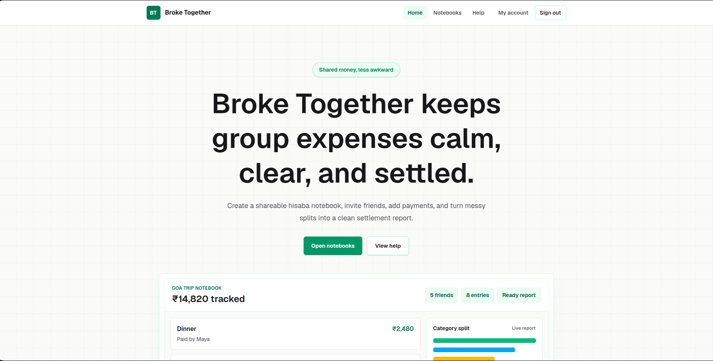

<div align="center">
  
  
  
  
  
</div>

<br />

<div align="center">
  <h1 align="center">Broke-Together 💸</h1>
  <p align="center">
    A seamless, modern web application for tracking shared expenses, generating comprehensive reports, and keeping your finances transparent.
  </p>
</div>

---

## 📸 Sneak Peek




---

## 🚀 Tech Stack

We utilize a modern and robust technology stack to deliver a fast, responsive, and reliable experience:

- **Frontend:** [Next.js](https://nextjs.org/) (App Router) & [React 19](https://react.dev/) for a lightning-fast, server-rendered user interface.
- **Styling:** [Tailwind CSS v4](https://tailwindcss.com/) for beautiful, responsive, and maintainable utility-first styling.
- **Backend & Database:** [Firebase](https://firebase.google.com/) for seamless real-time data storage (Firestore) and authentication.
- **Language:** [TypeScript](https://www.typescriptlang.org/) for end-to-end type safety and developer productivity.
- **Reporting:** `jspdf` & `html2canvas-pro` to generate crisp, downloadable PDF reports directly from the browser.

---

## 💡 How It Works (Workflow)

Using Broke-Together is incredibly straightforward:

1. **Create a Notebook:** Start by creating a dedicated notebook for your trip, event, or shared living situation.
2. **Track Expenses:** Add expenses dynamically. Record who paid, what it was for, and how much it cost.
3. **Real-time Sync:** Powered by Firebase, all your data syncs instantly across all devices.
4. **Generate Reports:** With a single click, view a beautifully formatted summary and export it to a high-quality PDF to share with others.

---

## 🛠️ Getting Started

Want to run Broke-Together locally? Follow these simple steps:

### Prerequisites

Make sure you have [Node.js](https://nodejs.org/) installed on your machine.

### Installation

1. **Clone the repository:**
   ```bash
   git clone https://github.com/mohitraghav1318/Broke-Together.git
   cd Broke-Together
   ```

2. **Install dependencies:**
   ```bash
   npm install
   ```

3. **Set up Environment Variables:**
   Create a `.env.local` file in the root directory and add your Firebase configuration credentials:
   ```env
   NEXT_PUBLIC_FIREBASE_API_KEY=your_api_key
   NEXT_PUBLIC_FIREBASE_AUTH_DOMAIN=your_auth_domain
   NEXT_PUBLIC_FIREBASE_PROJECT_ID=your_project_id
   NEXT_PUBLIC_FIREBASE_STORAGE_BUCKET=your_storage_bucket
   NEXT_PUBLIC_FIREBASE_MESSAGING_SENDER_ID=your_messaging_sender_id
   NEXT_PUBLIC_FIREBASE_APP_ID=your_app_id
   ```

4. **Run the development server:**
   ```bash
   npm run dev
   ```

5. **Open the app:**
   Navigate to [http://localhost:3000](http://localhost:3000) in your browser to see the application in action!

---

## 🤝 Contributing

We love contributions! Broke-Together is open-source, and we welcome developers of all skill levels to help improve the project.

**How to contribute:**
1. Fork the Project.
2. Create your Feature Branch (`git checkout -b feature/AmazingFeature`).
3. Commit your Changes (`git commit -m 'Add some AmazingFeature'`).
4. Push to the Branch (`git push origin feature/AmazingFeature`).
5. Open a Pull Request.

Please make sure your code adheres to our linting rules and try to write clear commit messages.

---

## 📜 License

Distributed under the MIT License. See `LICENSE` for more information.

---

<div align="center">
  <i>Built with ❤️ for hassle-free shared finances.</i>
</div>
